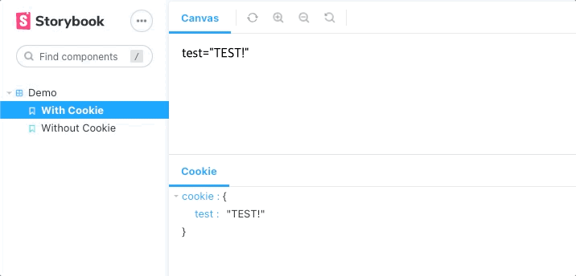

<h1 align="center">Storybook Addon Cookie</h1>

<p align="center">
  
</p>

### Support Storybook v7

Starting with storybook-addon-cookie v3, it supports storybook v7.

Use v2.x if you're using storybook v6.x.

## Features

- Set `document.cookie` for each Storybook.

[Live demo](https://www.chromatic.com/library?appId=6208f3782689be003ab39da3)

## Installing and Setup

### Install addon

With npm:

```sh
npm i storybook-addon-cookie -D
```

Or with yarn:

```sh
yarn add storybook-addon-cookie -D
```

### Configure the addon

Add package to storybook configuration.

```javascript
// .storybook/main.js
module.exports = {
  addons: [
    // ..other addons
    'storybook-addon-cookie',
  ],
};
```

If you want to use it only in a specific story, you can provide `cookieDecorator` to story.

But you can't control cookie by the panel.

```js
// Component.stories.jsx
import React from 'react';
import Component from './Component';

import { cookieDecorator } from 'storybook-addon-cookie';

export default {
  title: 'Component',
  compoent: Component,
  decorators: [cookieDecorator],
};
```

## Usage

You can pass cookie object into `cookie` parameter.

Or control cookie by addon panel.

```jsx
export default {
  component: Example,
  title: 'Example',
};

const Template = () => <Example />;

export const WithCookie = Template.bind({});
WithCookie.parameters = {
  cookie: {
    test: 'TEST!',
  },
};

export const WithOutCookie = Template.bind({});
```

Each Story has independent cookie.
